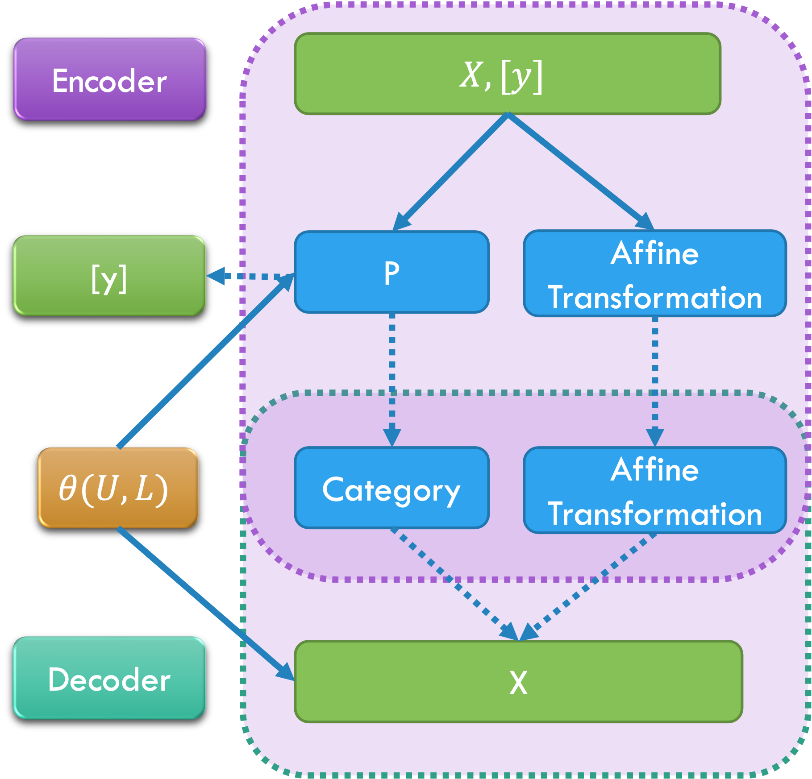

# Eigen Component Analysis (ECA)

This repository hosts the implementation of the Eigen Component Analysis (ECA) model, a novel machine learning model designed to perform tasks such as prediction, classification, and more. It combines concepts from linear algebra, deep learning, and probabilistic modeling to achieve powerful and flexible learning capabilities.

## Model Structure

The ECA model consists of several key components, and the data flow of the model is illustrated in the diagram below:



## Mathematical Background

The model operates on several mathematical principles, including:

1. Affine Transformations: The PredictAffine module applies an affine transformation to the input data. This transformation is a combination of linear transformations (rotation, scaling, and shearing) and translation (shifting).
2. Bernoulli Distributions: The UL module uses Bernoulli distributions to generate a binary mask matrix, L, which is used in the calculation of the reconstruction and activation.
3. Matrix Exponential: The UL module applies a matrix exponential to a matrix U, ensuring that U is a positive semi-definite matrix. This operation can be interpreted as a continuous and differentiable version of matrix operations.
4. Gumbel Softmax: A Gumbel softmax function is used to make a discrete choice in the forward pass of the model, providing a way to backpropagate through random choices.

## Getting Started

To use this model, you need to have PyTorch installed in your environment. You can then clone this repository and run the model with your own data by modifying the data loading part of the script.

```bash
git clone https://github.com/lachlanchen/eca.git
cd eca
python model.py
```

## License

This project is licensed under the MIT License. See the [LICENSE](https://chat.openai.com/LICENSE) file for details.

## Contact

If you have any questions or issues, please open an issue or submit a pull request.